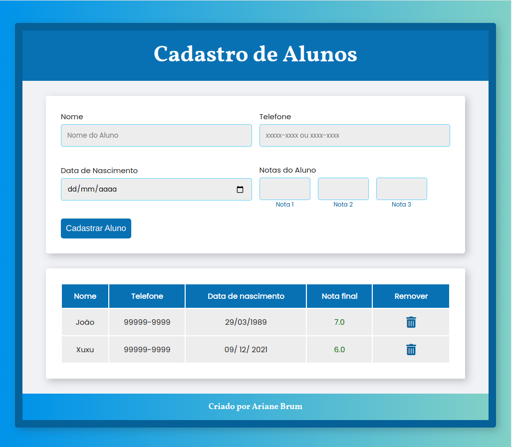
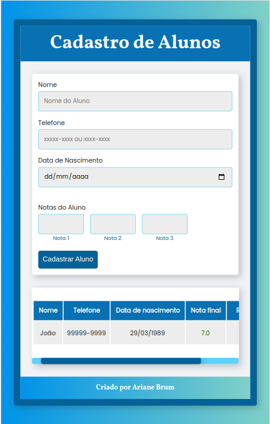

 <a href="#objetivo">Objetivo</a> •
 <a href="#preview">Preview</a> •
 <a href="#funcionalidades">Funcionalidades</a> • 
 <a href="#tecnologias">Tecnologias utilizadas</a> • 
 

<h3 id="objetivo">🔖 Objetivo</h3>

🚀 O projeto desenvolvido é um teste para o processo seletivo de incubação da <a href="https://www.maisprati.com.br/" target="_blank">+PraTi</a> em parceria com a <a href="http://www.alfamidia.com.br/web-design/" target="_blank">Alfamídia</a>, cujo objetivo é criar um cadastro/exibição de alunos numa página web, utilizando JavaScript e HTML somente. 

  <h3 id="preview">Screenshots das telas</h3>
  <h2>:camera_flash: Desktop</h2>
  
    
  <h3 align="left" >:iphone: Mobile</h3>
  

Cadastro de alunos:
  <a href="" target="_blank">Clique para visitar o projeto</a>

<h3 id="funcionalidades">✅ Funcionalidades</h3>

- [x] **Formulário de alunos**: Página HTML (com CSS) contendo um formulário de alunos.

- [x] **Criar aluno**: Ao criar um aluno, exibir os dados do mesmo na mesma página, logo abaixo do formulário, em linhas. Uma linha para cada aluno.

- [x] **Informações do aluno**: Nome, Telefone, Data de nascimento e Nota final do curso.

- [x] **Nota final colorida**: Se a média do aluno for maior ou igual a 5, a nota final ficara com a cor verde, caso contrário, a cor será vermelha.

- [x] **Mensagem de Sucesso**: Ao cadastrar um aluno, mostrar mensagem de sucesso e atualizar a lista com os alunos.

- [x] **Opção de remover aluno**: Botão para remover aluno.

- [x] **Layout responsivo**

<h3 id="tecnologias">⚡ Tecnologias utilizadas</h3>

- HTML5
- CSS3
- JavaScript
- Fontawesome

Made with :hearts: by Ariane Brum.
